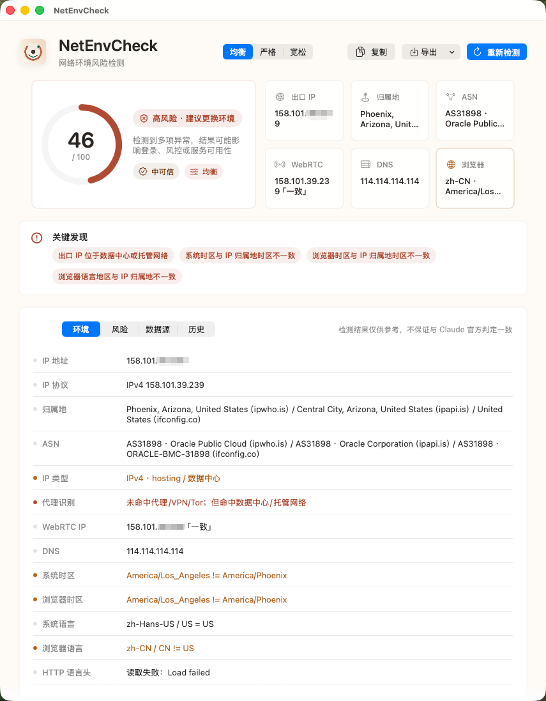
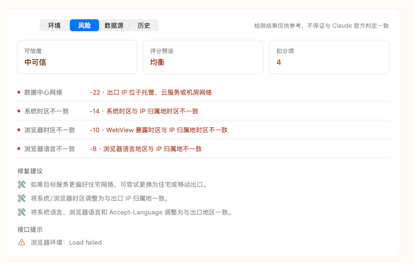
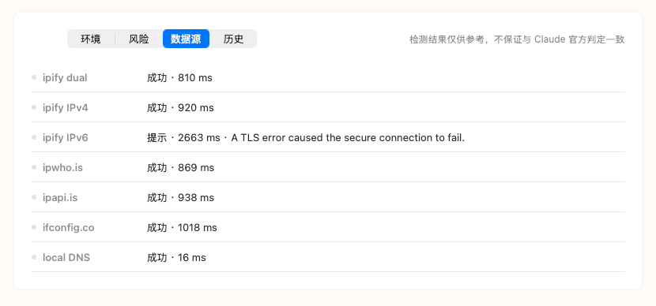
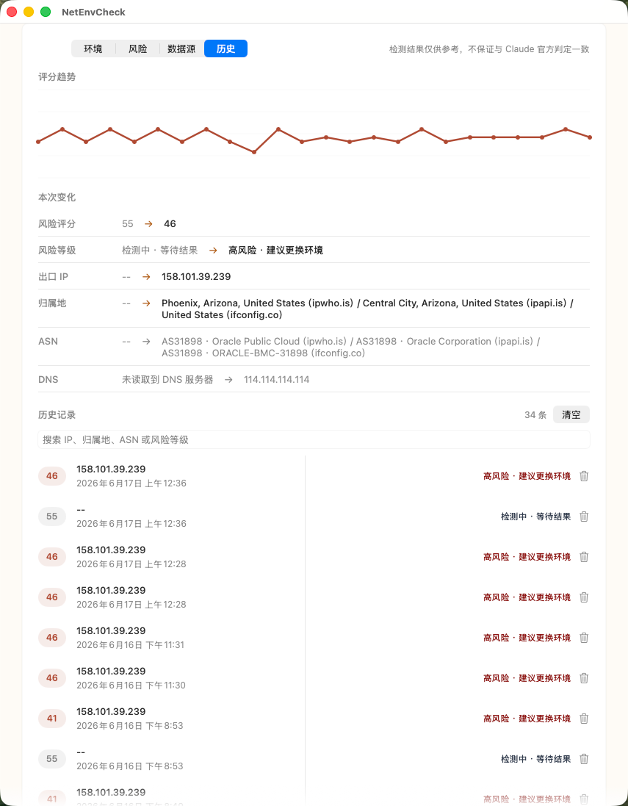
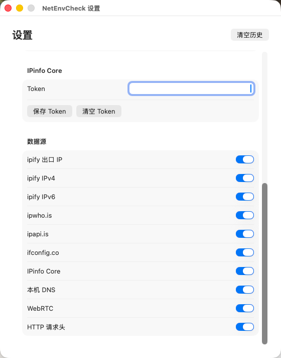

# NetEnvCheck
Claude网络环境风险检测小工具，本地 macOS 原生工具。
一个本地 macOS 原生网络环境风险检测小工具，用 SwiftUI + AppKit + WKWebView 编写。

GitHub: https://github.com/xie8266509/NetEnvCheck

下载最新版本: https://github.com/xie8266509/NetEnvCheck/releases/latest

## 截图

<p>
  
</p>

<p>
  
  
</p>

<p>
  
</p>

<p>
  
</p>

## 当前能力

- 出口公网 IP、IPv4、IPv6
- 多源归属地、ASN、运营商/组织
- 数据中心、代理、VPN、Tor、滥用记录启发式识别
- WebRTC/STUN 候选公网 IP 检测
- 本机 DNS 解析器读取与公共解析器风险提示
- 系统时区/语言与 IP 归属地一致性
- 浏览器时区/语言、User-Agent、HTTP Accept-Language 检测
- 均衡、严格、宽松三种评分预设
- 扣分明细、数据源状态、耗时、错误提示和可信度
- 修复中心：按风险项生成修复方案、预计改善分、操作步骤、复制命令/指南、打开系统设置和复测
- 优化前后对比：复测后展示评分变化、已改善项和新增风险
- 历史记录、前后对比、Markdown/JSON 导出
- 历史记录搜索、单条删除、清空、评分趋势、Markdown/JSON/HTML 导出
- 菜单栏常驻、风险变化通知、关于页和隐私说明
- 设置页：评分预设、历史保留、通知、自动检测、数据源开关、IPinfo Token
- Claude 风格温暖中性色 UI、imagegen 方向重设计 App 图标、release 打包、ad-hoc 签名、可选公证流程
- 应用内自检脚本

## 安装

1. 打开 [Releases](https://github.com/xie8266509/NetEnvCheck/releases/latest)
2. 下载 `NetEnvCheck.app.zip`
3. 解压后将 `NetEnvCheck.app` 拖到 Applications
4. 首次打开如果 macOS 提示未验证开发者，可在 Finder 中右键 App，选择“打开”

当前发布包默认使用 ad-hoc 签名；正式 Developer ID 签名和公证需要 Apple Developer 账号。

## 运行

```bash
swift run NetEnvCheck
```

## 自检

当前 Command Line Tools 环境没有可用的 XCTest/Testing 模块，所以项目提供应用内自检：

```bash
Scripts/run-tests.sh
```

等价于：

```bash
swift run NetEnvCheck --self-test
```

## 打包

```bash
Scripts/package-app.sh
```

打包后生成：

```text
dist/NetEnvCheck.app
```

默认会执行 release build、生成 `Resources/AppIcon-source.png` 与 `AppIcon.icns`、复制资源、写入 Info.plist，并使用 ad-hoc 签名。

如需正式签名：

```bash
CODESIGN_IDENTITY="Developer ID Application: Your Name (TEAMID)" Scripts/package-app.sh
```

如需公证，先在钥匙串配置 notarytool profile，然后执行：

```bash
CODESIGN_IDENTITY="Developer ID Application: Your Name (TEAMID)" \
NOTARY_PROFILE="your-notary-profile" \
Scripts/package-app.sh
```

## GitHub Actions

项目包含两个 workflow：

- `CI`：push/PR 时执行 `swift build`、`Scripts/run-tests.sh` 和打包，并上传 App artifact
- `Release`：推送 `v*` tag 时自动打包 `NetEnvCheck.app.zip` 并创建 GitHub Release

发布新版本示例：

```bash
git tag v1.3.0
git push origin v1.3.0
```

## 数据源

- ipify：出口公网 IP、IPv4、IPv6
- ipwho.is：归属地、ASN、时区
- ipapi.is：代理/VPN/Tor/数据中心/滥用信号
- ifconfig.co：额外归属地和 ASN 参考
- scutil --dns：本机 DNS 解析器
- WebRTC STUN：浏览器候选公网 IP
- httpbin headers：WebView HTTP 请求头回显
- IPinfo Core：可选高级 IP 情报源，需要 token

## 说明

检测依赖公开网络接口、本机系统设置和 WebView 能力，结果仅供参考，不保证与 Claude 或任何服务的官方风控判定一致。代理/VPN 精准识别通常需要商业 IP 情报库，本项目已把评分、来源状态和修复建议做成可解释结构，后续可以继续接入 MaxMind、IPinfo、IPQualityScore、Scamalytics 等数据源。

修复中心默认只做安全辅助：打开相关系统设置、复制命令、复制指南和重新检测。涉及 DNS、IPv6、代理等可能影响系统网络的操作不会自动执行，需要用户确认后自行处理。

## 可选 IPinfo Core

如果你有 IPinfo token，可以通过环境变量启动：

```bash
IPINFO_TOKEN="your-token" swift run NetEnvCheck
```

或写入本机配置文件：

```json
{
  "ipinfoToken": "your-token"
}
```

配置文件路径：

```text
~/Library/Application Support/NetEnvCheck/config.json
```

配置后，检测结果会额外出现 `IPinfo Core` 数据源，并补充地理、ASN、hosting、proxy、VPN、Tor、mobile 等网络标记。

在 App 中也可以通过“设置”窗口保存 IPinfo Token。设置页保存时会优先写入 macOS Keychain。
